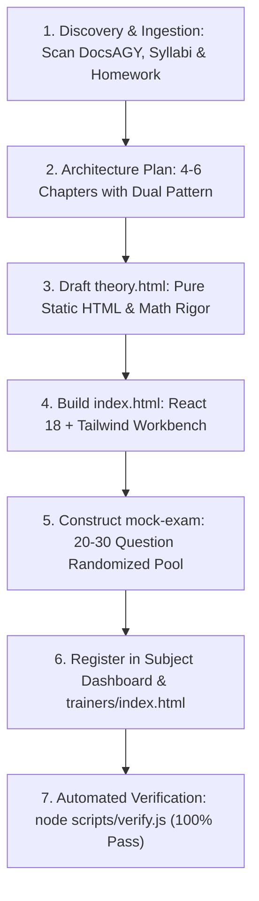

# 🎓 ExamTrainers — Agent Directives & Engineering Standards

Welcome to **ExamTrainers** (`andreisugu/ExamTrainers`). This project is a curated, open-source collection of interactive exam training web applications published to GitHub Pages (`gh-pages`). It is designed to help computer science and engineering students (currently focusing on University of Craiova - UCV, AN3 and AN4) pass challenging exams through interactive solvers, visualizers, homework decoders, and timed mock tests.

---

## 🏛️ 1. Architecture & Directory Standard

The repository follows a clean, predictable multi-page directory hierarchy:

```
ExamTrainers/
├── trainers/
│   ├── index.html                           # Landing hub & catalog of all available trainers
│   │
│   ├── an3-sem2/micro/                      # Subject: Microprocesoare (AVR ASM, timers, interrupts)
│   │   ├── index.html                       # Subject dashboard
│   │   ├── setup/                           # Chapter 1 (index.html + theory.html)
│   │   ├── timers/                          # Chapter 2 (index.html + theory.html)
│   │   └── ...
│   │
│   ├── an4-sem1/securitatea-datelor/        # Subject: Securitatea Datelor (SD)
│   │   ├── index.html                       # Subject dashboard (breadcrumbs, stats, chapter cards)
│   │   ├── delastelle/                      # Chapter 1: Bifid & Trifid (index.html + theory.html)
│   │   ├── classical/                       # Chapter 2: Caesar, ROT13, Vigenère, Kasiski, Ic
│   │   ├── asymmetric/                      # Chapter 3: RSA, Square-and-Multiply, CRT, Diffie-Hellman
│   │   ├── symmetric/                       # Chapter 4: AES State Matrix, Round Stepper, Block Modes (ECB/CBC)
│   │   ├── websec/                          # Chapter 5: DVWA SQLi/XSS/CSRF, Burp Cluster Bomb, HTB Invites
│   │   └── mock-exam/                       # Chapter 6: Timed Mock Exam (30 questions, UCV grade 1-10, 15 Commandments)
│   │
│   └── an4-sem1/proiectarea-translatoarelor/ # Subject: Proiectarea Translatoarelor (Compilatoare & M+-)
│       ├── index.html                       # Subject dashboard (breadcrumbs, stats, chapter cards)
│       ├── lexer-automata/                  # Chapter 1: Lexical Analysis, Thompson, Hopcroft, Flex
│       ├── top-down-ll1/                    # Chapter 2: Top-Down LL(1) Parsing & Recursive Descent
│       ├── bottom-up-lr/                    # Chapter 3: Bottom-Up LR/LALR & Bison
│       ├── semantics-mplusminus/            # Chapter 4: Static Semantics, Type Checking & M+-
│       └── mock-exam/                       # Chapter 5: Timed Mock Exam (60 min, 15 questions, 10 Commandments)
│
├── .github/workflows/pages.yml              # CI/CD: Deploys `trainers/` directly to GitHub Pages
├── scripts/
│   └── verify.js                            # Automated CI & pre-commit verifier (Babel, links, theory purity)
├── README.md                                # Repository overview and catalog index
└── AGENTS.md                                # This authoritative engineering standard
```

---

## ⚡ 2. Core Architectural Principles

1. **Zero-Build, Static Delivery:**
   - There is **no Node.js build step, bundler, or package manager** in production.
   - All pages run directly in any modern browser via standard CDN links (Tailwind CSS, React 18 UMD, and Babel Standalone for interactive components).
   - This ensures instant zero-friction deployment to GitHub Pages and guarantees that any student can clone the repository and double-click any `index.html` to run it offline via `file://`.

2. **The Multi-Page Dual Pattern (`index.html` + `theory.html`):**
   - **Never bundle an entire subject into a monolithic single-page app.**
   - Every chapter MUST have:
     - `index.html`: Interactive, highly visual tool with live state, sliders, inputs, visual matrices, and immediate feedback.
     - `theory.html`: Comprehensive theoretical reference, mathematical proofs, step-by-step algorithms, worked homework examples, and exam trap alerts.

3. **Strict Separation of Concerns:**
   - **Theory Pages (`theory.html`) MUST BE PURE STATIC HTML.**
     - Do NOT import React or Babel in `theory.html`.
     - Never use React `.map()` expressions, curly braces, or JSX syntax in `theory.html`.
     - Use clean semantic HTML typography (`<strong>`, `<em>`, `<code>`, `<pre>`, `<kbd>`) and HTML math entities (`&phi;`, `&Zopf;<sub>26</sub>`, `&rarr;`, `&rArr;`, `&times;`, `&oplus;`, `&le;`, `&ge;`).
   - **Interactive Pages (`index.html`) USE REACT 18 + BABEL:**
     - Use React 18 (`React.useState`, `React.useEffect`, `React.useMemo`).
     - Render into `<div id="root"></div>` via `ReactDOM.createRoot(document.getElementById('root')).render(<App />);`.

---

## 🚨 3. Critical Syntax & Coding Traps for Agents

### ⚠️ A. The JSX LaTeX Interpolation Trap
- **The Bug:** Writing LaTeX like `\mathbf{U}` or `\phi(n)` directly in JSX text.
- **The Consequence:** Babel standalone parses `{U}` as a JavaScript variable interpolation, throwing:
  ```
  Uncaught ReferenceError: U is not defined
  ```
- **The Rule:** In React JSX files, **never write raw LaTeX math symbols with curly braces**. Always use semantic HTML tags or plain entities:
  - ❌ BAD: `$(5, 1) \to \mathbf{U}$`
  - ✅ GOOD: `<span>(5, 1) &rarr; <strong>U</strong></span>`

### ⚠️ B. The HTML `<script>` Closing Tag Trap
- **The Bug:** Writing `</script>` or unescaped HTML tags inside string literals inside a `<script>` tag.
- **The Consequence:** The browser HTML parser immediately terminates the script block regardless of whether it was inside a JS string literal.
- **The Rule:** Escape closing tags in string literals (e.g. `<\/script>` or HTML entity `&lt;/script&gt;`).

### ⚠️ C. Void Elements in JSX Must Be Self-Closing
- **The Bug:** Writing `<br>`, `<hr>`, ``, or `<input ...>` in React components without a closing slash.
- **The Consequence:** Babel standalone throws `SyntaxError: Expected corresponding JSX closing tag for <br>`.
- **The Rule:** Every void tag in JSX must be self-closed: `<br />`, `<hr />`, ``, `<input ... />`.

### ⚠️ D. Class Attribute Hygiene
- In React JSX (`index.html`): ALWAYS use `className="..."`.
- In Static HTML (`theory.html`): ALWAYS use `class="..."`.

### ⚠️ E. Relative Path Integrity
- ExamTrainers is hosted at `https://andreisugu.github.io/ExamTrainers/` AND executed locally via `file://`.
- **Never use root-relative paths like `/trainers/...` or `/css/...`.**
- Always use strictly calculated relative paths:
  - From `trainers/index.html` to a subject: `./an4-sem1/securitatea-datelor/`
  - From a chapter `index.html` to parent dashboard: `../index.html`
  - From a chapter `index.html` to main hub: `../../../index.html`
  - Between `index.html` and `theory.html` in the same chapter: `./theory.html` and `./index.html`.

---

## 🎯 4. Course & Exam Fidelity Directives

Simulators and solvers in this repository must **never be generic toys**. They must reflect the exact requirements, edge cases, and grading criteria taught by university professors:

1. **Include Official Homework Presets:**
   - Every tool should feature a "Quick Load / Presets" toolbar loading official course exercises, homework texts, and exam problems directly into the solver with a single click.
2. **Implement Step-by-Step Derivations (Zero Hand-Waving):**
   - Don't just show the final answer; show the intermediary tables and traces:
     - Delastelle: Polybius coordinates $\to$ row/col concatenation $\to$ block re-grouping ($k < p$).
     - RSA: Extended Euclidean Algorithm Bezout table ($r_i, q_i, s_i, t_i$).
     - Square-and-Multiply: Bit-by-bit trace table showing Bit, Square, Multiply, formula and mod $n$ value.
     - AES: 4x4 State Matrix in Column-Major order, SubBytes S-Box mapping, ShiftRows offsets, MixColumns MDS multiplication in $\mathrm{GF}(2^8)$ with irreducible polynomial `0x11B`, AddRoundKey XOR.
     - PT Lexer: Subset construction with $\epsilon$-closure, Hopcroft state partitioning, Flex Maximal Munch tracking `Last-Final`.
     - PT LL(1): Step-by-step FIRST & FOLLOW computation with $\epsilon$ rule ($\epsilon \notin \text{FOLLOW}$), LL(1) stack matching.
     - PT LALR(1): Dragon Book core merging proof with LR(1) lookahead unioning, showing that core merging CANNOT create Shift-Reduce conflicts, only Reduce-Reduce conflicts.
     - PT Semantics: Scoped symbol table (shadowing vs duplicate trap), $M^{+-}$ type checking (`WHILE 1 DO` boolean error), 3AC quadruples, DEF/USE dataflow sets.
3. **Explicitly Teach Exam Traps:**
   - Highlight common student pitfalls with styled alert boxes:
     - **Delastelle:** Partial blocks ($k < p$) do NOT pad with 'X'.
     - **Caesar:** Modular subtractions in $\mathbb{Z}_{26}$ with negative values require adding $+26$.
     - **RSA Exponent:** Private exponent $d$ is calculated strictly $\pmod{\phi(n)}$, NEVER $\pmod{n}$.
     - **AES Round 10:** The final round **OMITS MixColumns** to ensure decryption symmetry.
     - **Side-Channel Timing:** Square-and-Multiply executes Square for bit 0, and Square+Multiply for bit 1; execution timing leaks private key bits.
     - **RSA Signatures:** Multiplicatively malleable $S(M_1 \cdot M_2) = S(M_1) \cdot S(M_2)$ without probabilistic padding (RSA-PSS).
     - **Birthday Paradox:** Collision complexity on an $n$-bit hash is $\mathcal{O}(2^{n/2})$, NOT $\mathcal{O}(2^n)$.
     - **HMAC:** Solves Merkle-Damgård length extension attacks using nested hashing with `ipad` (`0x36`) and `opad` (`0x5C`).
     - **Kerberos:** Replay protection validates Authenticator timestamps within $\pm 5$ minutes, strictly requiring NTP synchronization.
     - **TLS 1.3:** Enforces Perfect Forward Secrecy (PFS) via ECDHE; 0-RTT Early Data is vulnerable to replay attacks on POST requests.
     - **DVWA Medium SQLi:** Receives numeric POST inputs without quotes (`id=1 OR 1=1`, not `' OR '1'='1`).
     - **Burp Suite:** Correct credentials identified by HTTP response `Length` difference (e.g. `4738` vs `4554`).
     - **PT Lexer:** Keywords vs Identifiers ordering in Flex rules (first-rule-wins trap) and longest-match fallback when no match succeeds.
     - **PT LL(1):** $\epsilon$ is NEVER placed in $\text{FOLLOW}(A)$. Left factoring does not eliminate left recursion.
     - **PT LALR(1):** LALR(1) tables have the EXACT same number of states as SLR(1) and LR(0), only lookaheads differ.
     - **PT Semantics:** $M^{+-}$ does NOT allow integer expressions in conditions (`WHILE 1 DO` is a fatal type error); local variables shadow globals without modifying outer scope.

---

## 📜 5. The "Tratat Complet" Academic Standard & Synthesis Protocol

For deep theoretical fidelity, every ExamTrainer subject maps to an authoritative, 20–35 page academic treatise generated in Typst (located in `DocsAGY/` of the course repository):
- **Authoritative Governance Document:** Read [`DocsAGY/GHID_CREARE_TRATATE_COMPLETE.md`](file:///home/restlessstone/Documents/UCV/An4Sem1/ACE_cursuri_CR4.1/DocsAGY/GHID_CREARE_TRATATE_COMPLETE.md) before generating or upgrading subject theory.
- **The 5-Layer Synthesis Architecture:**
  1. *Stratul 1 (Top Traps):* Fatal exam traps classified by student failure rate.
  2. *Stratul 2 (Formal Theory):* Rigorous mathematical definitions (Shannon, Euler, Fermat, Galois Fields $\mathrm{GF}(2^8)$, CFG, LALR(1)).
  3. *Stratul 3 (Step-by-Step Manual Calculations):* Every algorithm must be trace-printable (Bézout tables, Square-and-Multiply bit-by-bit traces, Delastelle partial blocks). Zero Hand-Waving permitted!
  4. *Stratul 4 (Applied Security & Labs):* Exact payloads, Burp Suite request length heuristics, DVWA level differences, WAF bypasses.
  5. *Stratul 5 (Exam Bank & The 10 Commandments):* Comprehensive exam questions with model answers + summary cheat sheet.

---

## 🛠️ 6. Step-by-Step Procedure for Creating a New Subject / Chapter

When an agent is tasked with building a new ExamTrainer subject or chapter, follow this sequence:



### Step 1: Discovery & Curriculum Ingestion
1. Scan the university course folder (e.g. `DocsAGY/`, lecture slides, lab manuals, handwritten assignments like `cifru.pdf` or exam archives).
2. Note the professor's naming conventions, specific algorithms, preferred exam numbers, and grading pitfalls.

### Step 2: Architecture Planning
1. Organize the subject into 4 to 6 logical chapters.
2. Ensure every chapter follows the dual file standard:
   - `trainers/<semester>/<subject>/<chapter>/index.html` (Interactive Tool)
   - `trainers/<semester>/<subject>/<chapter>/theory.html` (Static Theory Guide)
3. Reserve the final chapter for `mock-exam/` (interactive simulator + cheat sheet).

### Step 3: Drafting `theory.html`
1. Use the standard ExamTrainers dark layout (`#090d16` background, radial glow, circuit-grid).
2. Keep it **100% pure static HTML** (no React, no Babel, no unclosed JSX tags).
3. Include structured callout cards for exam traps (`bg-rose-950/25 border-rose-500/30`), definitions, and fully worked homework problems.

### Step 4: Engineering `index.html`
1. Use React 18 UMD + Babel Standalone + Tailwind CSS.
2. Build interactive inputs with live state updates, step-by-step navigation, and quick-load preset buttons.
3. Verify that all void elements (`<input />`, `<br />`, `<hr />`, ``) are self-closed and no LaTeX `{}` expressions exist in JSX text.

### Step 5: Constructing `mock-exam/`
1. Include at least **20 to 30 comprehensive questions** spanning all chapters.
2. Provide modes: Quick Test (10 questions), Exam Simulation (20 questions), and Full Marathon (all questions).
3. Compute official UCV grade (1–10) with detailed rationales for each option.
4. In `mock-exam/theory.html`, write the condensed "Cele 10-15 Porunci ale Examenului".

### Step 6: Subject Dashboard & Hub Registration
1. In `trainers/<semester>/<subject>/index.html`, display breadcrumbs, title, quick stats, and responsive cards for every chapter.
2. In `trainers/index.html`, add the subject to the `TRAINERS` array with title, subtitle, description, topic, status, and relative href.
3. In `README.md`, update the subject catalog list.

### Step 7: Automated Verification
Run:
```bash
node scripts/verify.js
```
Fix any syntax, Babel compilation, or dead link issues immediately.

---

## 🔄 7. Maintenance & Cross-Referencing Protocol (The Cross-Audit Standard)

When maintaining or upgrading an existing trainer:

1. **Perform a Gap Analysis against the Master Guide:**
   - Open the latest Typst treatise in `DocsAGY/` (e.g. `Securitatea_Datelor_Ghid_Examen_Complet.typ`).
   - Audit the trainer against the guide: Does the trainer cover all modern algorithms, mathematical theorems, protocols, and lab nuances?
2. **Preserve All Existing Functionality:**
   - **Never delete or break working tools or presets.**
   - If adding new features (such as AES or Square-and-Multiply), integrate them as new tabs, sections, or dedicated chapters.
3. **Expand the Mock Exam Question Pool:**
   - Any newly added theoretical section MUST be reflected in `mock-exam/index.html` by adding 2–4 rigorous exam questions testing the specific trap.
4. **Update the Cheat Sheet:**
   - Ensure `mock-exam/theory.html` includes any newly discovered rules of thumb or exam traps.

---

## 🎨 8. Visual, UX & Responsive Design Standards

To ensure a cohesive, professional aesthetic across the entire fleet of trainers:

- **Color Palette:**
  - Base Background: `#090d16` (Deep Midnight Obsidian) with `.circuit-grid` (36px linear gradient mesh).
  - Accents:
    - Cybersecurity / WebSec: `rose-500` / `rose-400`
    - Classical / Translators / LR: `indigo-500` / `indigo-400`
    - Asymmetric / Automata / Success: `emerald-500` / `emerald-400`
    - Math / Stepper / Warnings: `amber-500` / `amber-400`
    - Mock Exam / Testing: `purple-500` / `purple-400`
- **Typography:**
  - Headings & Body: `Outfit`, sans-serif (clean modern neo-grotesque).
  - Code, Math Traces, Hex & Matrices: `JetBrains Mono`, monospace.
- **Responsiveness:**
  - Full mobile and tablet support: grids adapt from `grid-cols-1` on mobile to `md:grid-cols-2` and `lg:grid-cols-3` or `4` on desktop.
- **Offline Resilience:**
  - Pages must operate completely offline when opened via `file://` once browser assets are cached.

---

## ✅ 9. Pre-Commit Quality Checklist for Agents

Before completing any task or proposing a git commit, agents must execute the following checks:

1. **Automated Verification Script:**
   - Always run `node scripts/verify.js`. It runs headless compilation via `@babel/standalone` across every `<script type="text/babel">` in the repo, validates all relative `href` and `src` links, checks theory purity, and catches unclosed tags or JSX syntax traps before they reach the browser.
2. **Link Verification Check:**
   - Ensured via `node scripts/verify.js` (0 dead links allowed).
3. **Theory Page Purity Check:**
   - Ensured via `node scripts/verify.js` (`theory.html` must remain pure static HTML).
4. **Hub & Catalog Registration:**
   - If a new trainer or chapter is created:
     - Register it in `trainers/index.html` (in the `TRAINERS` array and stats badges).
     - Update `README.md` to list the new trainer.
5. **Git Protocol:**
   - Remote URL must use SSH: `git@github.com:andreisugu/ExamTrainers.git`.
   - Never push to `main` without explicit user permission.
